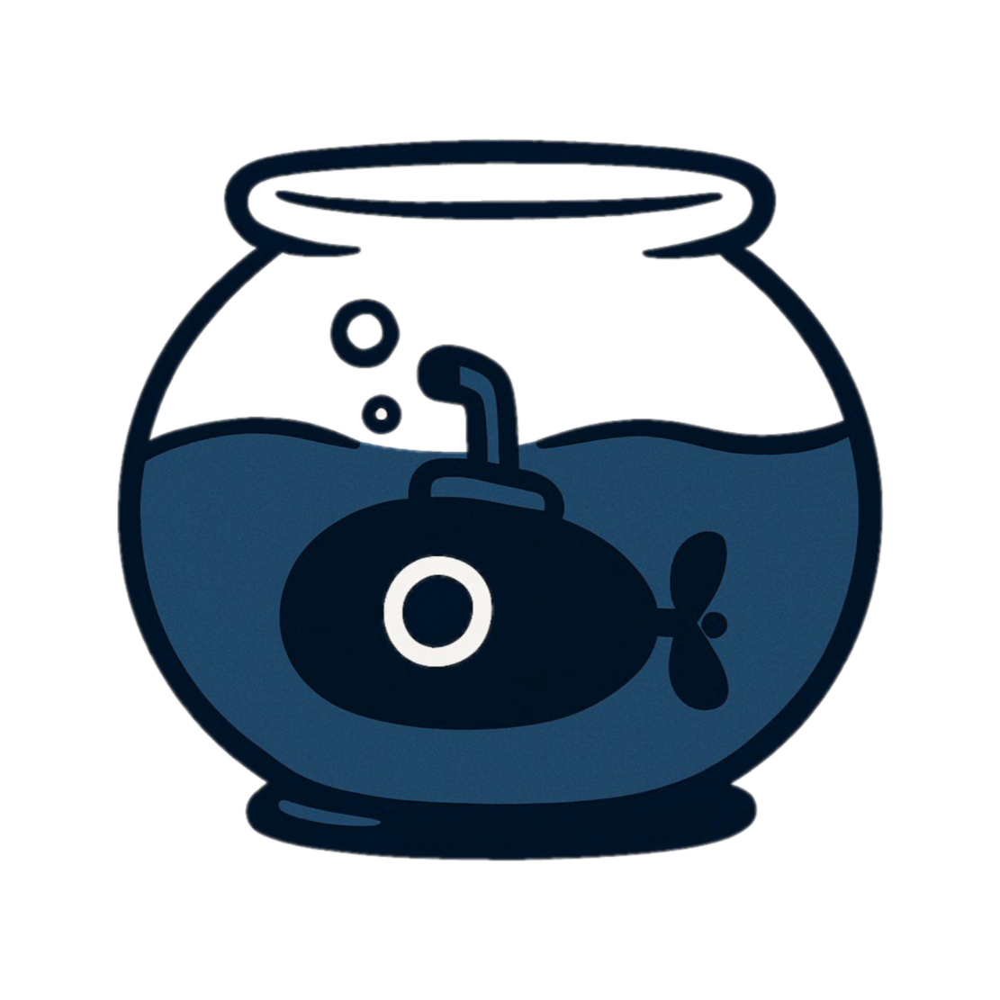

# Aquario
Repositorio para el desarrollo de la página web de el proyecto "Aquario".

  

## Colaboradores
- Alixmar Machuca
- Barbara Correa
- Jhanfred Herrera
- Jhostin Urbano
- Jose Torres
- Moises Requena
- Valentina Oropeza

- <iframe frameborder="0" src="https://itch.io/embed/3683526?link_color=5b67fa" width="552" height="167"><a href="">Bugquest (Seaquest Remake) by bcrandom306</a></iframe>

    

      
    

    

      
Bugquest (Seaquest Remake)

      
by bcrandom306

      
Remake de Seaquest para Atari 2600 en LÖVE2D (pero t...

      <a href="https://itch.io](https://bcrandom306.itch.io/bugquest-seaquest-remake" target="_blank" style="display: inline-block; margin-top: 10px; padding: 8px 12px; background-color: #665EFF; color: white; text-decoration: none; border-radius: 4px; font-weight: bold; font-size: 14px;">
        Download on itch.io
      </a>
    

    

      
    

  

